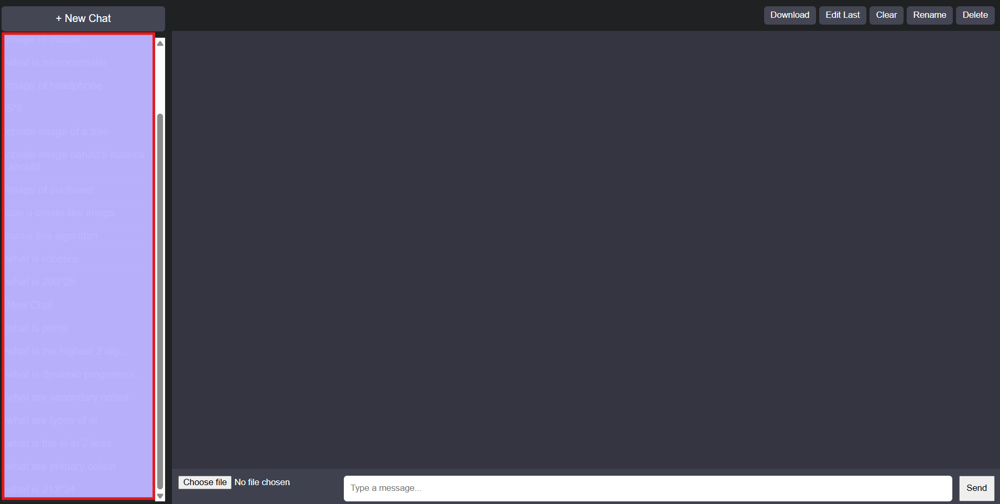
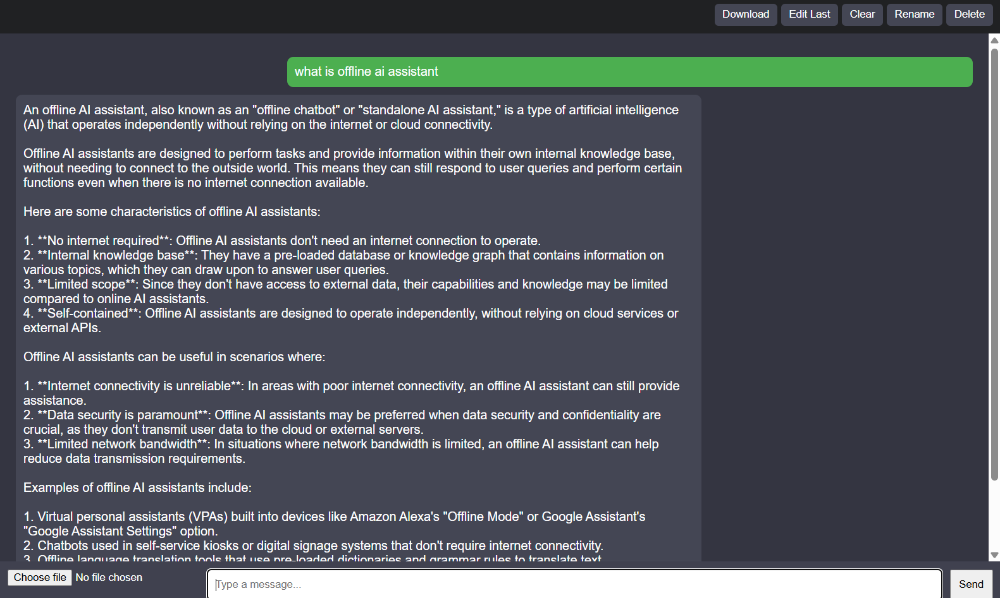
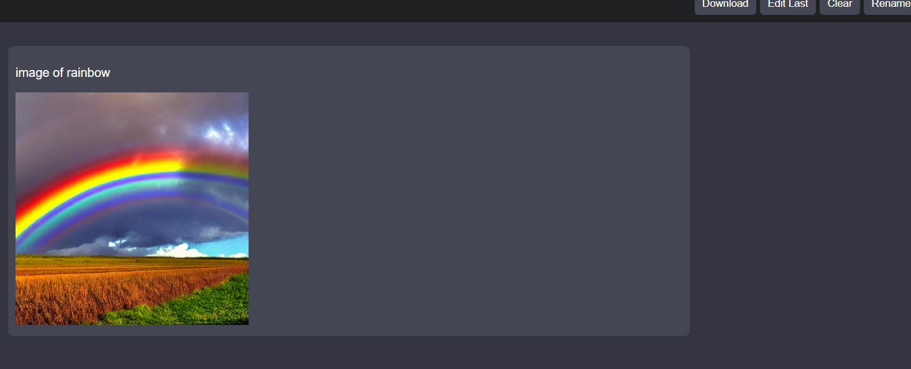

# AI Assistant (Offline AI Clone)

## Features
- Multi-chat system
- Auto chat naming
- File upload (PDF, TXT, PPTX)
- AI-based question answering
- Chat history storage
- Delete chat feature
- Image generation (Stable Diffusion)

## Tech Stack
- Frontend: HTML, CSS, JavaScript
- Backend: Flask (Python)
- AI Model: LLaMA3 via Ollama
- Image Model: Stable Diffusion via Hugging Face Diffusers
- Database: PostgreSQL

## How to Run

1. Install dependencies:
pip install -r requirements.txt
2. Start Ollama:
ollama run llama3
3. Run Flask app:
python app.py
4. Open browser:

## Screenshots

### Main UI

### Chat Example

### Image Generation
